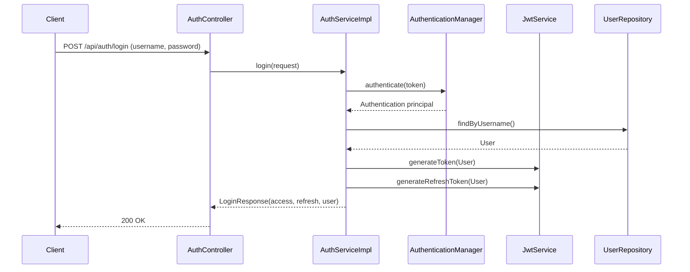
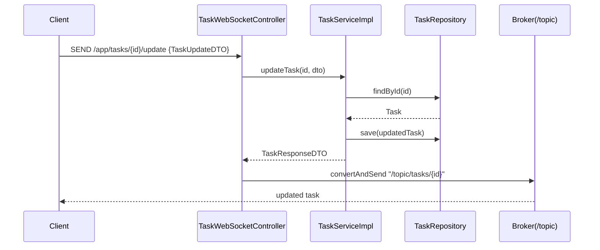
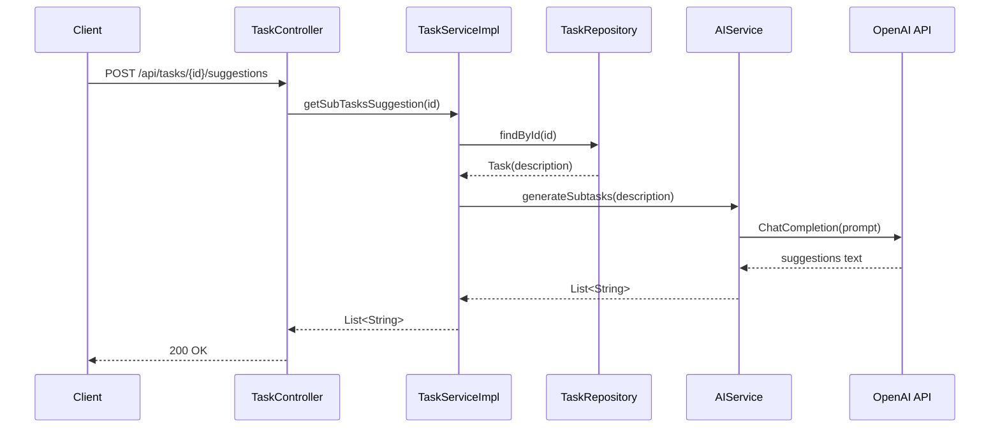

# Smart Task Manager — Architecture & Technical Documentation

## 1. Project Overview

Smart Task Manager is a Spring Boot backend that manages projects and tasks with user authentication and role-based authorization. It exposes REST APIs for CRUD operations, provides real-time task updates via WebSockets, and integrates an AI service to suggest task prioritization and subtasks.

### Core Functionalities
- User registration, login, JWT-based authorization and refresh tokens
- Project management: create, read, update, delete
- Task management: create, read, update, delete
- Real-time task updates via STOMP/WebSocket
- AI-assisted suggestions for task priority and subtasks
- API documentation exposed via Swagger/OpenAPI

### Business Purpose
- Centralize task and project tracking for teams
- Support real-time collaboration on task updates
- Provide intelligent assistance to break down tasks and prioritize work

## 2. Architecture

### Component Diagram
```mermaid
flowchart LR
    Client[Client (Front-end)] -- REST --> Controllers
    Client -- STOMP/WebSocket --> WSController

    subgraph Controllers
      AuthC[AuthController]
      UserC[UserController]
      ProjectC[ProjectController]
      TaskC[TaskController]
      WSController[TaskWebSocketController]
    end

    Controllers --> Services

    subgraph Services
      AuthS[AuthServiceImpl]
      UserS[UserServiceImpl]
      ProjectS[ProjectServiceImpl]
      TaskS[TaskServiceImpl]
      AIS[AIService]
    end

    Services --> Mappers
    Mappers --> Entities
    Services --> Repos
    Repos --> DB[(PostgreSQL)]

    subgraph Security
      SecConfig[SecurityConfig]
      JwtFilter[JwtAuthenticationFilter]
      JwtSvc[JwtService]
    end

    Controllers --> Security
    Security --> Services

    subgraph Config
      WebSocketConfig
      SwaggerConfig
      OpenAIConfig
      DataInitializer
    end

    AIS --> OpenAI[OpenAI API]
```

### Request Lifecycle (REST)
1. Client calls REST endpoint on a controller
2. Controller delegates to domain service
3. Service uses repositories to access data and MapStruct to map DTOs
4. Security filter authenticates JWT before controller execution
5. Response DTO returned to client

### WebSocket Message Flow
- Client sends STOMP message to `/app/tasks/{taskId}/update`
- `TaskWebSocketController` updates the task via service, then broadcasts to `/topic/tasks/{taskId}`

## 3. Technical Specifications

### Technologies & Versions
- Java: 17 (`pom.xml`)
- Spring Boot: 3.4.2 (`spring-boot-starter-parent`)
- Spring Boot Starters: Actuator, Web, Security, Data JPA, Validation
- Spring WebSocket
- MapStruct: 1.6.3
- Lombok: 1.18.36
- JJWT: 0.12.6
- springdoc-openapi: 2.8.3
- OpenAI Java client: 0.18.2
- spring-dotenv: 4.0.0
- PostgreSQL JDBC: 42.5.0
- TensorFlow: 1.12.0 (present but not referenced in code paths)

### Infrastructure Details
- Application server: Spring Boot (`SmartTaskManagerApplication`)
- Database: PostgreSQL configured via `application.yml`
- Authentication: JWT (stateless, HMAC signature)
- WebSocket: STOMP endpoint `/ws` (SockJS), prefix `/app`, broker `/topic`
- API Documentation: Swagger UI at `/swagger-ui.html` and `/v3/api-docs`
- Containerization: Multi-stage Dockerfile builds a JAR and runs as non-root user

### Configuration & Environment Variables
- `SERVER_PORT` default `8080`
- `SPRING_PROFILES_ACTIVE` default `dev`
- `DB_URL` default `jdbc:postgresql://localhost:5432/smart_task_db`
- `DB_USERNAME` default `postgres`
- `DB_PASSWORD` default `root`
- `JWT_SECRET_KEY` (base64-encoded key)
- `JWT_ACCESS_TOKEN_EXPIRATION` default `900000` ms
- `JWT_REFRESH_TOKEN_EXPIRATION` default `604800000` ms
- `OPENAI_API_KEY`
- `OPENAI_MODEL` default `gpt-3.5-turbo` (note: AIService currently hardcodes model)

## 4. Functional Documentation

### Authentication
- `POST /api/auth/login` → returns access/refresh tokens and user profile
- `POST /api/auth/register` → creates user and returns profile
- `POST /api/auth/refresh` → validates refresh token and returns new tokens

DTOs
- `LoginRequest(username, password)`
- `RegisterRequestDTO(firstname, lastname, username, password)` (password policy enforced)
- `RefreshTokenRequest(refreshToken)`
- `LoginResponse(accessToken, refreshToken, user)`
- `AuthResponse(accessToken, refreshToken)`
- `UserResponseDTO(id, firstname, lastname, username, roles)`

### Users
- `GET /api/users` → list users
- `GET /api/users/me` → current authenticated user profile
- `PUT /api/users/me` → update profile (`UserUpdateDTO`)
- `POST /api/users/{userId}/roles` → assign roles (Admin only)

### Projects
- `POST /api/projects` → create (`ProjectRequestDTO` → `ProjectResponseDTO`)
- `GET /api/projects` → list
- `GET /api/projects/{id}` → get by id
- `PUT /api/projects/{id}` → update (`ProjectRequestDTO`)
- `DELETE /api/projects/{id}` → delete and cascade remove tasks

### Tasks
- `GET /api/tasks` → list (`TaskResponseDTO`)
- `POST /api/tasks` → create (`TaskRequestDTO` → `TaskResponseDTO`)
- `GET /api/tasks/{taskId}` → get by id
- `PUT /api/tasks/{taskId}` → update (`TaskUpdateDTO` → `TaskResponseDTO`)
- `DELETE /api/tasks/{taskId}` → delete
- `POST /api/tasks/{taskId}/suggestions` → AI-generated subtasks (`List<String>`)

### WebSocket (STOMP)
- Handshake endpoint: `/ws` (SockJS enabled)
- Send updates: `/app/tasks/{taskId}/update` (payload: `TaskUpdateDTO`)
- Subscribe for updates: `/topic/tasks/{taskId}` (payload: `TaskResponseDTO`)

## 5. Data Flow Diagrams

### Login & Token Issuance


### Task Update via WebSocket


### AI Subtasks Suggestion


## 6. Implementation Details

### Code Organization
- Entry Point: `SmartTaskManagerApplication` with `@EnableJpaAuditing`
- Controllers: `AuthController`, `UserController`, `ProjectController`, `TaskController`, `TaskWebSocketController`
- Services: `AuthServiceImpl`, `UserServiceImpl`, `ProjectServiceImpl`, `TaskServiceImpl`, `AIService`
- Repositories: `UserRepository`, `RoleRepository`, `ProjectRepository`, `TaskRepository`
- Entities: `User`, `Role`, `Project`, `Task`
- Mappers: `UserMapper`, `TaskMapper`, `ProjectMapper` (MapStruct)
- Security: `SecurityConfig`, `JwtAuthenticationFilter`, `JwtService`
- Config: `SwaggerConfig`, `WebSocketConfig`, `OpenAIConfig`, `DataInitializer`

### Design Patterns & Practices
- Layered architecture (Controller → Service → Repository)
- DTO + Mapper pattern with MapStruct for clean boundaries
- Stateless JWT authentication with a servlet filter
- External AI service abstraction for suggestions

### Entities & Relations
- `User` has many `Role` (EAGER), one-to-many `Task`
- `Task` belongs to `Project` (LAZY) and `User` (default EAGER)
- `Project` has one-to-many `Task` and helper methods to manage relation
- Auditing timestamps present on `Task` and partially on `Project`

### Security Configuration
- Stateless sessions, CSRF disabled
- Public endpoints: `/api/auth/**`, Swagger resources
- All other endpoints require authentication
- Password hashing via `BCryptPasswordEncoder`

### Configuration Files
- `application.yml` controls server, DB, JPA, JWT, Swagger, logging
- `OpenAIConfig` builds `OpenAiService` from `OPENAI_API_KEY`

## 7. Quality Standards

### Testing Strategy
- Current: context load test
- Recommended:
  - Unit tests for `JwtService` (token generation/validation/expiry)
  - Controller integration tests for auth/projects/tasks with `spring-security-test`
  - Service tests for `ProjectServiceImpl.deleteProject` (task cleanup) and `TaskServiceImpl.updateTask`
  - WebSocket integration tests for STOMP endpoints and topic broadcasting
  - AI service tests with mocked `OpenAiService`

### Performance Considerations
- Disable SQL show in production
- Index foreign keys (`task.project_id`, `task.user_id`)
- Consider LAZY fetch for `Task.assignedUser` to avoid N+1 on lists
- Use pagination for list endpoints when datasets grow

### Security Considerations
- Strong base64 JWT secret, rotated periodically
- Persist refresh token on login to align with refresh validation
- Limit Swagger exposure in non-dev environments
- Validate WebSocket authentication if needed (currently unauthenticated STOMP)

## 8. Operations

### Local Run
- Ensure Postgres reachable and credentials match `application.yml`
- Provide `JWT_SECRET_KEY` (base64) and `OPENAI_API_KEY`
- Run Spring Boot app via Maven or IDE

### Docker
- Build: `docker build -t smart-task-manager .`
- Run: `docker run -p 8080:8080 \ 
    -e DB_URL=jdbc:postgresql://host:5432/smart_task_db \ 
    -e DB_USERNAME=postgres \ 
    -e DB_PASSWORD=secret \ 
    -e JWT_SECRET_KEY=base64Key \ 
    -e OPENAI_API_KEY=sk-... \ 
    smart-task-manager`

### Swagger
- API docs: `/v3/api-docs`
- Swagger UI: `/swagger-ui.html`

---

### References (selected)
- Security configuration: `src/main/java/com/smarttask/smart_task_manager/config/security/SecurityConfig.java`
- JWT service: `src/main/java/com/smarttask/smart_task_manager/config/security/jwt/JwtService.java`
- Auth service: `src/main/java/com/smarttask/smart_task_manager/service/impl/AuthServiceImpl.java`
- Task service: `src/main/java/com/smarttask/smart_task_manager/service/impl/TaskServiceImpl.java`
- WebSocket config: `src/main/java/com/smarttask/smart_task_manager/config/WebSocketConfig.java`
- AI service: `src/main/java/com/smarttask/smart_task_manager/service/impl/AIService.java`
- Swagger config: `src/main/java/com/smarttask/smart_task_manager/config/SwaggerConfig.java`
